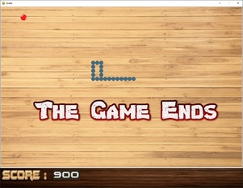
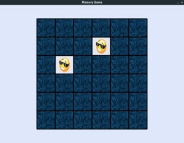

I am a computer science researcher working within Systems and Networking. My current research is focused on the following areas:
  - Utilizing recent advances such as _RDMA_ and _Programmable Switches (P4)_ to accelerate data center system performance
      
  - Improving techniques for _Data Deduplication_ with encrypted data
   
  - Analyzing the impact of _Networking Failures_ on large-scale software systems
  
I am enrolled in the PhD program in Computer Science at the University of Waterloo as a part of the Waterloo Advanced Systems Lab ([WASL](https://wasl.uwaterloo.ca/)). My supervisor is [Prof. Samer Al-Kiswany](https://cs.uwaterloo.ca/~alkiswan/index.html). Prior to this, I was enrolled in the research-based master's program at Waterloo from 2019-2021 and I have been a Design Engineer at Advanced Micro Devices (AMD) from 2017-2019. 

I received my master's degree in Computer Science from the University of Waterloo in 2021, working under the supervision of  [Prof. Samer Al-Kiswany](https://cs.uwaterloo.ca/~alkiswan/index.html). I received my undergraduate degree in Computer Science from PES University in Bangalore, India and have been supervised by [Dr. K.V Subramaniam](https://www.linkedin.com/in/kalsubra/?originalSubdomain=in) and [Dr. Phalachandra](https://staff.pes.edu/nm1313). I was a research assistant at [CCBD](http://research.pes.edu/cloud-computing-big-data/) during my time there.

I have experience developing systems in numerous languages such as C, C++, Java, JavaScript and Python along with limited experience in Solidity.

# Publications

 

 
 
  <strong> CASPR: Connectivity-Aware Scheduling for Partition Resilience </strong> (International Symposium on Reliable Distributed Systems 2023) 

  
  &nbsp;&nbsp;&nbsp;&nbsp;&nbsp;&nbsp;&nbsp;&nbsp; Sara Qunaibi, _Sreeharsha Udayashankar_ and Samer Al-Kiswany

 

 
 
   <strong>DedupBench - A benchmarking tool for data chunking techniques </strong> (IEEE CCECE 2023) <a href="https://cs.uwaterloo.ca/~alkiswan/papers/DedupBench_CCECE23.pdf">[PDF]</a>
  

  
  &nbsp;&nbsp;&nbsp;&nbsp;&nbsp;&nbsp;&nbsp;&nbsp; Alan Liu, Abdelrahman Ba'ba', _Sreeharsha Udayashankar_ and Samer Al-Kiswany

 

 
 
  <strong> Partial Network Partitioning </strong> (ACM Transactions on Computer Systems 2022) <a href="https://dl.acm.org/doi/10.1145/3576192">[Paper]</a> <a href="https://dl.acm.org/doi/pdf/10.1145/3576192">[PDF]</a>

  
  &nbsp;&nbsp;&nbsp;&nbsp;&nbsp;&nbsp;&nbsp;&nbsp;Basil Alkhatib, _Sreeharsha Udayashankar_, Sara Qunaibi, Ahmed Alquraan, Mohammed Alfatafta, Wael Al-Manasrah, Alex Depoutovitch and Samer Al-Kiswany

 

 
 
 <strong> Orcbench: A Representative Serverless Benchmark </strong> (IEEE Cloud 2022) <a href="https://ieeexplore.ieee.org/document/9860528")>[Paper]</a> <a href="https://rcs.uwaterloo.ca/~ryan/files/orcbench.pdf">[PDF]</a> 

 
  &nbsp;&nbsp;&nbsp;&nbsp;&nbsp;&nbsp;&nbsp;&nbsp; Ryan Hancock, _Sreeharsha Udayashankar_, Ali Mashtizadeh and Samer Al-Kiswany

 

 
 
 <strong> Benchmarking Diferentially Private Algorithms </strong> (TPDP - ICML 2021) <a href="https://tpdp.journalprivacyconfidentiality.org/2021/papers/NingUQKH21.pdf">[PDF]</a>

   
  &nbsp;&nbsp;&nbsp;&nbsp;&nbsp;&nbsp;&nbsp;&nbsp; Huiyi Ning, _Sreeharsha Udayashankar_, Sara Qunaibi, Karl Knopf and Xi He

 

 
 
 <strong> In-Network Scheduling for Real-Time Analytics </strong> (MMath Thesis - 2021) <a href="https://uwspace.uwaterloo.ca/handle/10012/16922">[Thesis]</a>

  
  &nbsp;&nbsp;&nbsp;&nbsp;&nbsp;&nbsp;&nbsp;&nbsp; _Sreeharsha Udayashankar_

 

 

 <strong> Falcon - Low Latency Network Accelerated Scheduling </strong> (EuroP4 - ACM CoNext 2020) <a href="https://dl.acm.org/doi/10.1145/3426744.3431322">[Paper]</a> <a href="https://cs.uwaterloo.ca/~alkiswan/papers/Falcon-EuroP420.pdf">[PDF]</a> 

  
  &nbsp;&nbsp;&nbsp;&nbsp;&nbsp;&nbsp;&nbsp;&nbsp; Ibrahim Kettaneh, _Sreeharsha Udayashankar_, Ashraf Abdel-Hadi, Robin Grosman and Samer Al-Kiswany

 

 
 
 <strong> Gaming Modeling and Projections - The Impact of CPU Performance </strong> (AMD Asia Tech Conference 2019) 

  
  &nbsp;&nbsp;&nbsp;&nbsp;&nbsp;&nbsp;&nbsp;&nbsp; _Sreeharsha Udayashankar_, Saumya Chandra and Don Cherepacha

 

# Patents

 
  

    <strong> System and method of deduplication for encrypted content </strong>  
    &nbsp;&nbsp;&nbsp;&nbsp;&nbsp;&nbsp;&nbsp;&nbsp;<em>Best patent award at Acronis 2023 </em>
  

   
  
   &nbsp;&nbsp;&nbsp;&nbsp;&nbsp;&nbsp;&nbsp;&nbsp;_Sreeharsha Udayashankar_, Abdelrahman Ba'ba', Samer Al-Kiswany, Serg Bell and Stanislav Protasov
   
 

# Side Projects

In my spare time, I develop applications with a variety of languages and tools. Some of these projects and their source code are showcased in this section.

## MuZero on Super Mario Bros

I have attempted to evaluate MuZero, an algorithm for deep learning published by Google Deepmind in 2019, against Deep-Q-Networks with Double-Q-Learning, the state of the art model free algorithm. I have compared their performance using the game Super Mario Bros. The system architectural diagram has been shown below:

  

    
  

Clips of an agent trained using MuZero playing the game can be found below:

|  Training GIF 1 |  Training GIF 2 |
:-------------------------:|:-------------------------:
|  |  |

| Training GIF 3 | Training GIF 4 |
:-------------------------:|:-------------------------:
|  |  |

**Details**

- [Repository Link](https://github.com/sreeharshau/muzero-super-mario-bros)
- [Evaluation Report](Evaluating_MuZero_Super_Mario_Bros.pdf)

## The Crypto Lottery

This project consists of an Ethereum-based back end and a front end powered by React.js. The objective of this project was to build a lottery application where users register using Ether and stand a chance to win the Jackpot. 

The Jackpot is the prize pool consisting of contributions from all participants with the winner being chosen at regular time intervals. A participants chances also increase with the Ether they contribute up to a certain limit.
 
 

    
  

**Source Code**:

- [Crypto Lottery Frontend](https://github.com/sreeharshau/EthereumLotteryApplication_ReactUI)

- [Crypto Lottery Backend](https://github.com/sreeharshau/EthereumLottery_SmartContract)

## Python Game Collection

I have developed a few games in Python 3.6 using the PyGame library. Some of them are showcased below.

| Snake    | Memory Game    |
:-------------------------:|:-------------------------:
|  |  |

**Source Code**

 - [Snake](https://github.com/sreeharshau/snake-python)

 - [Emoji Memory Game](https://github.com/sreeharshau/memory-game-python)

# Hobbies

I enjoy running, cycling and hiking in my spare time. Here are a few images I've shot using my phone on some of my hikes:

## Canadian Hiking

| Sunshine Meadows - _Banff National Park_ | Peyto Lake - _Banff National Park_  |
:-------------------------:|:-------------------------:
  |  

| Flowerpot Island - _Bruce Peninsula National Park_ |   The Grotto - _Bruce Peninsula National Park_  |
:-------------------------:|:-------------------------:
  |  

| Centennial Ridges - _Algonquin Provincial Park_ |  Track and Tower - _Algonquin Provincial Park_ |
:-------------------------:|:-------------------------:
  |  

## Indian Hiking

BR Hills - _Karnataka_   |  Tadiandamol - _Karnataka_
:-------------------------:|:-------------------------:
  |  

